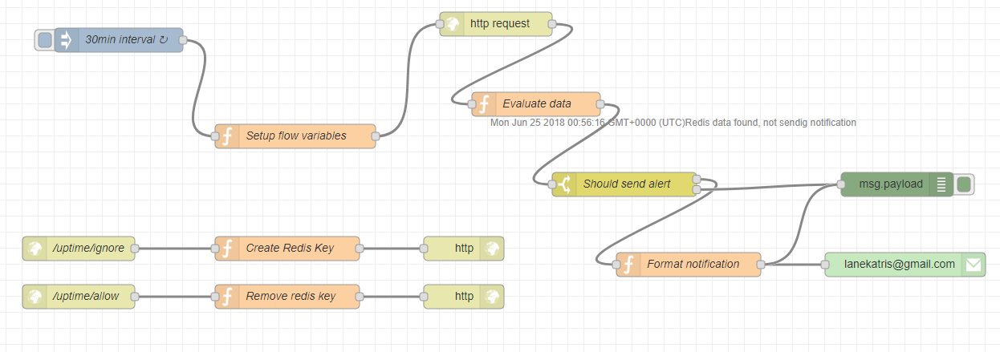

# What?
Dockerized .NET core web api that tells you the uptime of a Linux machine

# Why?
I'd like to be notified when there my home lab server restarts, usually because of a power outage. I then need to re-sync my aquarium light schedule with the lights with my smart phone.

Unfortunately the lights don't keep track of the schedule during power outages. 

# Getting Started
*Note*: Because this is dockerized, it looks for the uptime file in the following locations. You'll need to add them depending if your Windows or Linux/OSX

**Windows**: `C:/temp/uptime.txt`

**Linux**: `/data/uptime`

**Populate test file**:

`echo "9852.99 17711.51" > /data/uptime`

**Run from source code**:
```
git clone https://github.com/loonison101/Uptime.git
cd Uptime/src/Uptime.Web
dotnet run
curl http://localhost:5000/Uptime
```

**Docker Run**
```
cd Uptime
docker build -t uptime:0.0.1 .
# You need to run docker with an attached file, see above for the locations
docker run -d -v c:\temp\uptime.txt:/data/uptime -p 8080:80 uptime:0.0.1
```

**Kubernetes Run**
```
mkdir /nfs/pv-uptime
sudo ln -s /proc/uptime /nfs/pv-uptime/uptime

kubectl apply -f uptime.k8s.everything.yml
```

**Result**
```
{
    "seconds": 196976.83,
    "minutes": 3282.95,
    "hours": 54.72,
    "days": 2.28
}
```

# Overall functionality
`/proc/uptime` exposed on a nfs share, containerized application running in k8s can access a persistent volume claim, a http api allows access to the data, and finally a node-red flow checks at a set interval to determine if the box has gone down within 24 hours.

# How?
The `/proc/uptime` file determines the machine uptime in most Linux environments. Example contents below:

`
9852.99 17711.51
`

**First number**: How long the OS has been running in seconds

**Second number**: Idle time (what is this? :confused:) 

# Goals
1. **.NET core** - My experience in the past was with the full framework, wanted to dabble with core
2. **Dockerized**
3. **Hosted in Kubernetes** 

# Source Code Organization/Purpose
**Uptime.Web** - The web api that returns JSON with the uptime data, merely an http endpoint

**Uptime.Domain** - Contains all classes/interfaces to serve up the data; all the implementation details

**Uptime.Test** - Extremely basic unit tests to aid in testing the services in `Uptime.Domain`

**uptime.k8s.everything.yml** - All necessary components to function in Kubernetes. Contains the `storage class`, `persistent volume`, `persistent volume claim`, `deployment`, and `service`

**node-red.flow.json** - This is the entire flow for a node-red process that does the calling of the http api and sends email notifications

**docs** - README resource

# Kubernetes Information
The *kubernetes run* example above is using a NFS share and a persistent volume claim for the app to access it. Within that folder is a symbolic link to the  `/proc/uptime` file.
This was my initial solution to expose this file to a containerized app running in K8S.

# Other Processes
**Node-Red**

This process runs every 30 seconds and determines if the box has gone down. If it has, then it sends an email, if not it does nothing.

It does have an override, so if you don't want to get spammed for a day you can call the http endpoints in the flow and it will create a temporary way to stop getting notifications.